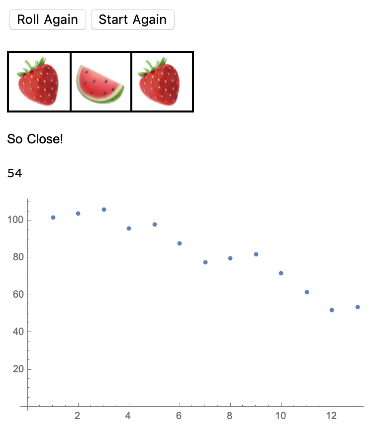

## Weather Data Dashboard

In this project, you'll use the Wolfram Language to create a weather dashboard, showing the Temperature, Humidity, Wind Speed and Wind Direction for a specific city.

### What you will make

--- collapse ---
---
title: What you will need
---

### Software

+ Wolfram Language
+ This project can be completed in a web browser using [wolframcloud.com](http://lab.wolframcloud.com/app/). Log in, and click Create New Notebook.

### Downloads

+ [rpf.io/project-name-go](http://rpf.io/project-name-go){:target="_blank"}

--- /collapse ---

--- collapse ---
---
title: What you will learn
---

+ Manipulating Weather Data in the Wolfram Language
+ Using Freefrom Lingustic Input in the Wolfram Language
+ Creating functions in the Wolfram Language

--- /collapse ---

--- collapse ---
---
title: Additional information for educators
---

If you need to print this project, please use the [printer-friendly version](https://projects.raspberrypi.org/en/projects/project-name/print){:target="_blank"}.

[Here is a link to the resources for this project](http://rpf.io/project-name-go).

--- /collapse ---
