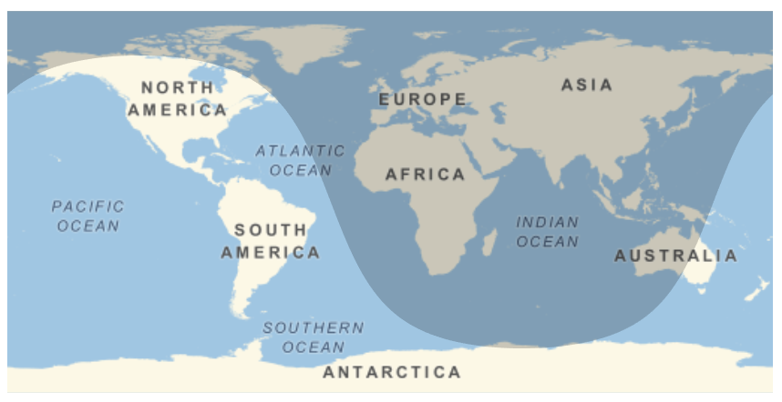

## Building a Map

In this step, you will build a map, find the Night Hemisphere, and highlight a specific country.

--- task ---

Create a map using `GeoGraphics[]` and specifying the region you want to show.

```
GeoGraphics[GeoRange -> "World"]
```


--- /task ---

The NightHemisphere function shades the part of the Earth which is currently in nighttime.

--- task ---

Add the Night Hemisphere to your map. Replace your previous code with your new code.

```GeoGraphics[NightHemisphere[], GeoRange -> "World"]```



--- /task ---

--- task ---
See if you can customize the map. Try using `DayNightTerminator` to add a line between the day hemisphere and the night hemisphere.
--- /task ---