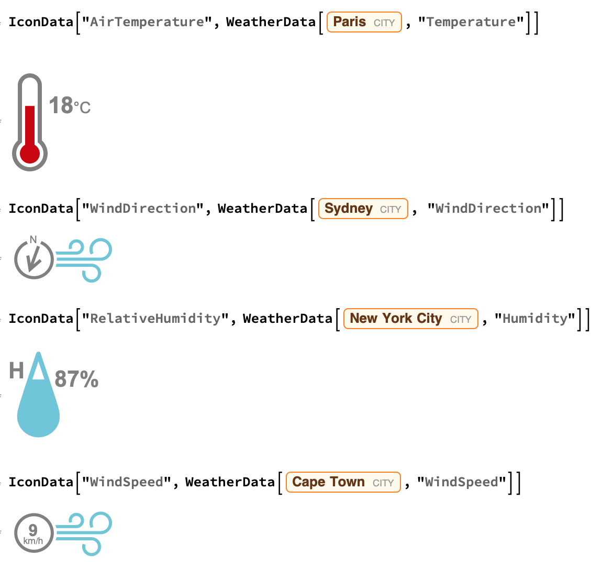

## Exploring Weather Data

In this step, you will explore `WeatherData` in Wolfram. 

Wolfram has all kinds current information about the weather. In order to find weather information for a specific place, you  enter a city using Freeform Linguistic Data.

When you start to type the name of a city, a pop up may appear, asking if you want to Convert to Freeform Linguistic Input. You should select this option.

You can also press `[Control] + [=]` to access a Freeform Input box directly within your code.

A final option is to put the name of the city in quotes `""`, which will work for the majority of cities.

```
WeatherData["Hanoi", "Temperature"]

WeatherData["Boston", "Humidity"]

WeatherData["Sydney", "WindDirection"]

WeatherData["Cape Town", "WindSpeed"]
```

`IconData` includes some cool weather icons which will be helpful in building this dashboard.



Try getting the temperature data and icon for your capital city

```
IconData["AirTemperature",
    WeatherData["London", "Temperature"]]
```

