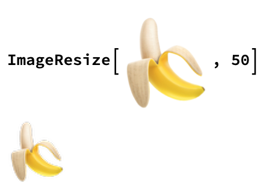
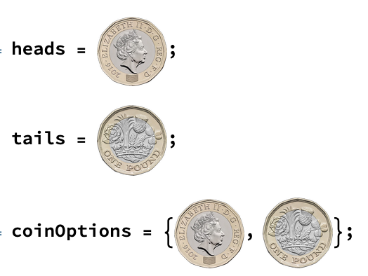

## Creating a Coin Flipper


First, we will be building the coin flipper. The coin flipper is fairly simple: we want to be able to press a button and randomly return either heads or tails.

--- task ---

First, we'll need images of both heads and tails. You can use these images by dragging them in to your notebook, or you could find other images, maybe in a different currency.


--- /task ---

--- task ---

Use `ImageResize` to resize your images so that they are 100 pixel squares.


--- /task ---

--- task ---
Now make a list which contains your coins.

When you run the code for `ImageResize`, the output will be the resized image. You can click on the resized image and copy it into your list.

Lists start with `{` and end with `}`, and each element is separated by a `,`.
Assign this list to the variable name `coinOptions`.



--- /task ---


We want to be able to flip the coin and randomly get either heads or tails. We can do this using `RandomChoice`.

```
RandomChoice[coinOptions]
```

It would be useful to have a button for the user to press in order to flip the coin.

--- task ---
Create a button which randomly outputs either Heads or Tails.

```
Button["Flip Coin", 
 Print[RandomChoice[coinOptions]]]
```
--- /task ---

You might notice that every time you press the button, the new output appears underneath the old output. It would be better to replace the old output with the new output each time you press the button.

We can do this using `Dynamic`. `Dynamic` displays the dynamically updated value, so each time we reevaluate the code by pressing the button, `Dynamic` will update to the new value.

--- task ---
Use `Dynamic` to create a button. 

```
coin = heads;
Button["Flip Coin", 
 coin = RandomChoice[coinOptions]]
Dynamic[coin]
```
--- /task ---

You can replace your old button with the new Dynamic one.