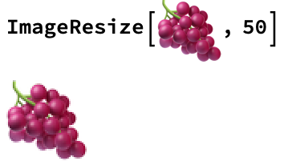

## Importing Images

--- task ---
The first step is to find pictures of fruits and get them into your notebook so you can use them in your project. You can do this by simply finding an image online, copying it, and pasting it into a cell. Try searching for 'fruit icons' and choosing five of your favorite fruits. Alternatively, you can use these images.

--- /task ---

You will need to resize your images so that they're all the same size. You can do this using ImageResize.

--- task ---
Now you can make a list of your fruits. Lists start with { and end with }, and each element is separated by a ,.

--- /task ---