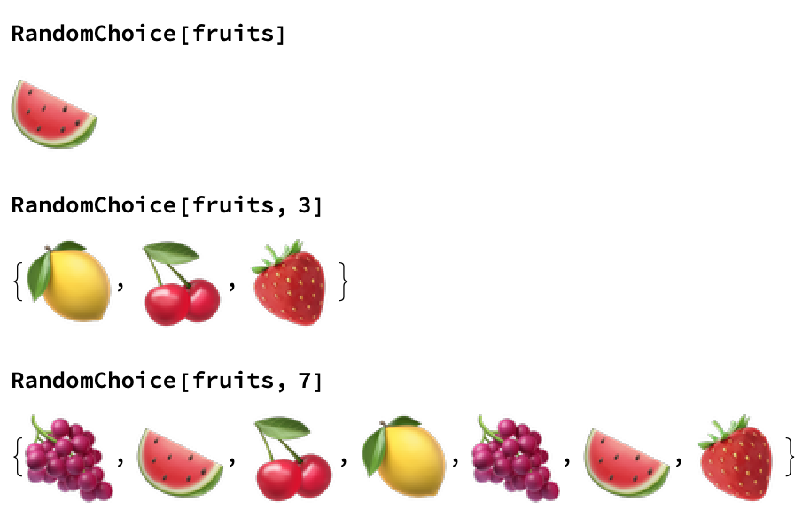

## Random Choices

The game requires three random fruits from the pile. An obvious way of doing this might be to take a RandomSample of the fruits. RandomSample allows us to pick three of the five fruits.

```
RandomSample[fruits, 3]
```

Can you see any problems with this technique? Try evaluating the line a few times.
It looks like this would be a pretty unfair game! RandomSample looks at the five fruits, and takes three of them. What we really want for this game is to look at the five fruits, take one, and then put it back so we can look at all five fruits again. This is called Random Sampling with Replacement, because we look at the whole group every time we want to choose a new item.
So we want to choose a fruit at random from the list of five, three separate times.
In order to choose just one fruit at random, we can use the RandomChoice function. 

```
RandomChoice[fruits]
```

We can then perform an evaluation multiple times.



--- task ---
We can also improve how this looks. At the moment, we have lots of coding elements, like {} and , which we don't necessarily want in our output. We can choose to put the fruit in a grid, with a frame, which lets us present them much like a real fruit machine.

```
Grid[{RandomChoice[fruits, 3]}, Frame -> All, FrameStyle -> Thick]
```


--- /task ---