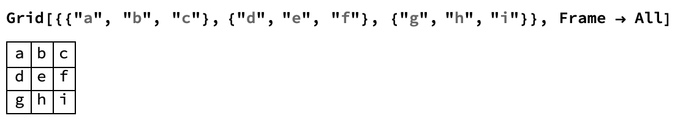
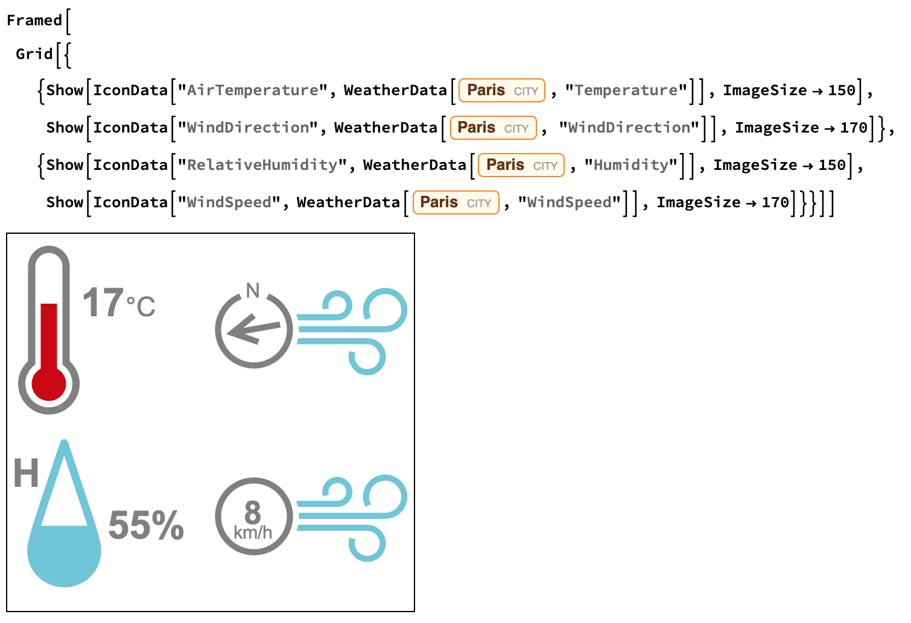

## Creating a Weather Dashboard

We have all the information we need to build a dashboard. Now we need to create a function which lets us easily change the location, and design a simple layout.
In order to customize the layout of the dashboard, we can use the Grid function. Grid allows us to put items into evenly spaced rows and columns. 



We want the four measurements to be displayed in a grid with the temperature and humidity on the left, and the wind speed and direction on the right.

That means that we want them to be in the order `{Temperature, WindDirection"},{Humidity, WindSpeed}`.

---task---

Build a grid using your `IconData` and `WeatherData` code.

```
Grid[{
  {IconData["AirTemperature", WeatherData["Paris", "Temperature"]],
  IconData["WindDirection", WeatherData["Paris", "WindDirection"]]},
  {IconData["RelativeHumidity", WeatherData["Paris", "Humidity"]],
  IconData["WindSpeed", WeatherData["Paris", "WindSpeed"]]}
  }]
  ```

---/task---

Ideally, we want to make all the icons larger. In order to do this, we need to use `Show`. `Show` allows us to specify the size of the image using `ImageSize`.

In order to make our output look more balanced, we might want to make the `WindSpeed` and `WindDirection` icons a little larger. 

--- task ---

Set the `ImageSize` for those icons for `AirTemperature` and `RelativeHumidity` to 150, `WindSpeed` and `WindDirection` to 170.

```
Grid[{
  {Show[IconData["AirTemperature", WeatherData["Hanoi", "Temperature"]], ImageSize -> 150], 
  Show[IconData["WindDirection", WeatherData["Hanoi", "WindDirection"]], ImageSize -> 170]}, 
  {Show[IconData["RelativeHumidity", WeatherData["Hanoi", "Humidity"]], ImageSize -> 150],
  Show[IconData["WindSpeed", WeatherData["Hanoi", "WindSpeed"]], ImageSize -> 170]}
  }]
```

--- /task ---

--- task ---
Add a title to your output by adding another row to the `Grid`. Use `Text` to show the title in text format, and customise the text size and colour using `Style`.
In order to center the title, you'll need to use `SpanFromLeft` to make the text row span both columns.

```
Grid[{
  {Text[Style["Hanoi", Large, Gray]], SpanFromLeft},
  {Show[IconData["AirTemperature", WeatherData["Hanoi", "Temperature"]], ImageSize -> 150],
  Show[IconData["WindDirection", WeatherData["Hanoi", "WindDirection"]], ImageSize -> 170]},
  {Show[IconData["RelativeHumidity", WeatherData["Hanoi", "Humidity"]], ImageSize -> 150],
  Show[IconData["WindSpeed", WeatherData["Hanoi", "WindSpeed"]], ImageSize -> 170]}
  }]
```
--- /task ---


We also want to put a frame around the icons, so the dashboard looks more cohesive. We can do this simply by putting a `Framed` function around the code we have for the Grid.



Why don't we try experimenting with the features for the frame? We could make the corners more round using `RoundingRadius`, increase the white space between the icons and the frame using `FrameMargins`, and change the color and weight of the frame using `FrameStyle`.

--- task ---

Add options to `Framed` to make an attractive output.

```
Framed[
 Grid[{
  {Text[Style["Hanoi", Large, Gray]], SpanFromLeft},
  {Show[IconData["AirTemperature", WeatherData["Hanoi", "Temperature"]], ImageSize -> 150],
  Show[IconData["WindDirection", WeatherData["Hanoi", "WindDirection"]], ImageSize -> 170]},
  {Show[IconData["RelativeHumidity", WeatherData["Hanoi", "Humidity"]], ImageSize -> 150],
  Show[IconData["WindSpeed", WeatherData["Hanoi", "WindSpeed"]], ImageSize -> 170]}
  }],
  RoundingRadius -> 40, FrameMargins -> 20, FrameStyle -> {Thick, Gray}]
 ```

--- /task ---

