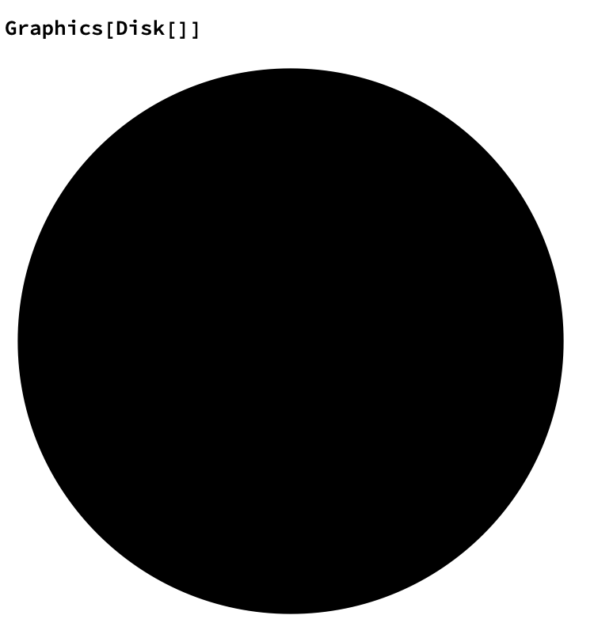
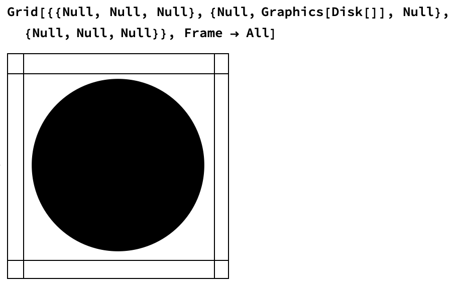
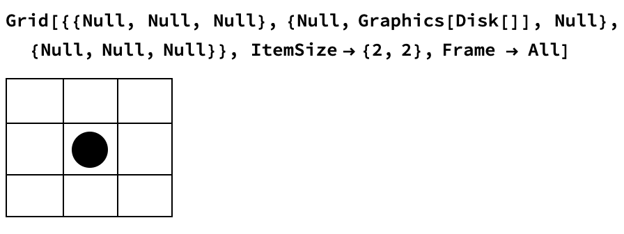
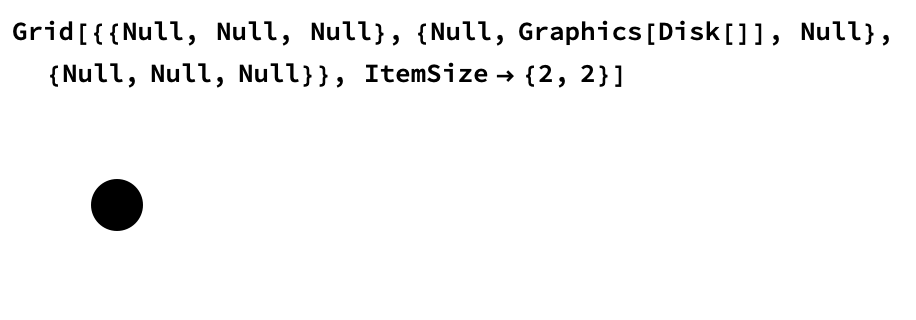
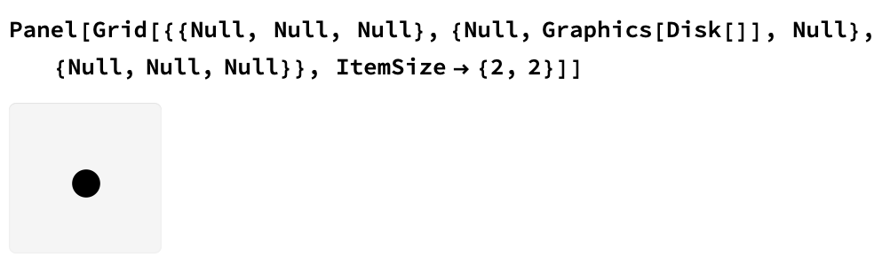
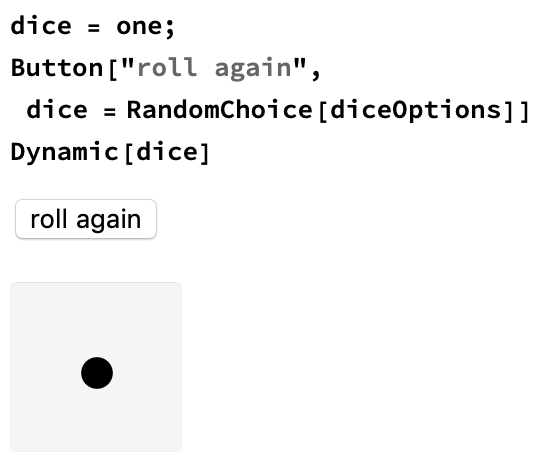

## Making the Die

Now we will build the dice roller. While we could simply import images of each face of the die, as we did for the coin flipper, it will be more interesting to create each face in code. 

Each face on a die is made up of nine boxes, and the boxes which correspond to the number are filled in with a circle.

We can construct this using `Grid` and `Graphics`.
Let's look at an easy example of `Grid`


Can you see how `Grid` works? `Grid` is made up of a list of lists, where each list becomes a row in the grid.

Let's work out how to make a circle, so that we can put circles into the relevant boxes in Grid. We make a circle using `Graphics` and `Disk`. 



--- task ---

Create a variable of a `Graphics[Disk[]]` called dot.

```dot = Graphics[Disk[]]```

--- /task ---

Let's make a grid for the number 1 on a die. A first attempt might be:



We also want to make all the boxes inside the grid the same size. We can do this by specifying `ItemSize`, which ensures that the disk and the `Null` gaps are all the same size.



Perfect! Let's make it look a little more like a die by removing the `Frame`



`Panel` gives a very nice grey background around objects, so let's use `Panel` to improve the appearance of our die.




--- task ---

Construct each of the six sides of the die, and assign each side to a variable name.


```
dot = Graphics[Disk[]];

one = Panel[
  Grid[{{Null, Null, Null}, {Null, dot, Null}, {Null, Null, Null}}, 
   ItemSize -> {2, 2}]];
   
two = Panel[
  Grid[{{dot, Null, Null}, {Null, Null, Null}, {Null, Null, dot}}, 
   ItemSize -> {2, 2}]];
   
three = Panel[
  Grid[{{dot, Null, Null}, {Null, dot, Null}, {Null, Null, dot}}, 
   ItemSize -> {2, 2}]];

four = Panel[
  Grid[{{dot, Null, dot}, {Null, Null, Null}, {dot, Null, dot}}, 
   ItemSize -> {2, 2}]];


five = Panel[
  Grid[{{dot, Null, dot}, {Null, dot, Null}, {dot, Null, dot}}, 
   ItemSize -> {2, 2}]];

six = Panel[
  Grid[{{dot, dot, dot}, {Null, Null, Null}, {dot, dot, dot}}, 
   ItemSize -> {2, 2}]];
   
```
--- /task ---

--- task ---
Make a list which contains all of the sides of the die, and assign it the variable name `diceOptions`

```
diceOptions = {one, two, three, four, five, six}
```

--- /task ---

In order to roll the dice, just like we did earlier to create a coin flipper, all we have to do is set up a `RandomChoice` between the six options in the list.

--- task ---
Use `RandomChoice` to randomly pick one of the sides in the list.

```
RandomChoice[diceOptions]
```

--- /task ---

--- task ---
Take the code you wrote to create a button for the coin flipper, and alter it to roll the die instead.



--- /task ---