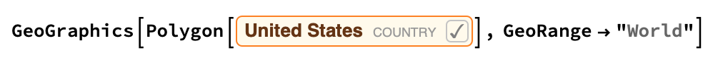
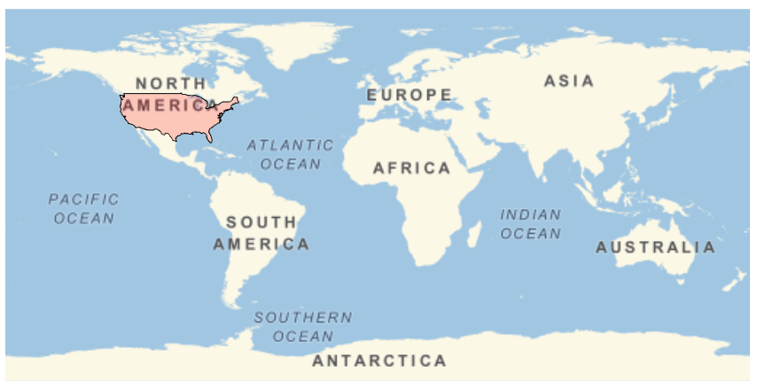

## Highlighting a Country

Once you have a map with a NightHemisphere highlighted, it's time to highlight a country. In this example, we're going to highlight the United States, but you can choose any country. Make sure that the country you choose is large enough to be seen clearly on the map.

--- task ---

Highlight the United States on the map.

```
GeoGraphics[Polygon[United States], GeoRange -> "World"]
```

--- /task ---

You will notice that when you type in a country, a pop up appears asking if you want to Convert to Freeform Linguistic Input. You should select this option.

You can also press `[Control] + [=]` to access a Freeform Input box directly within your code.




Just having the grey highlight on the map isn't very clear. Changing the colour of the polygon would help it stand out more.

--- task ---
Change the colour of the highlighted country to red, and add black edges.

```
GeoGraphics[{EdgeForm[Black], FaceForm[Red], Polygon[United States]}, 
 GeoRange -> "World"]
 ```


--- /task ---