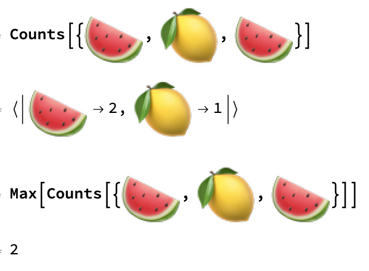
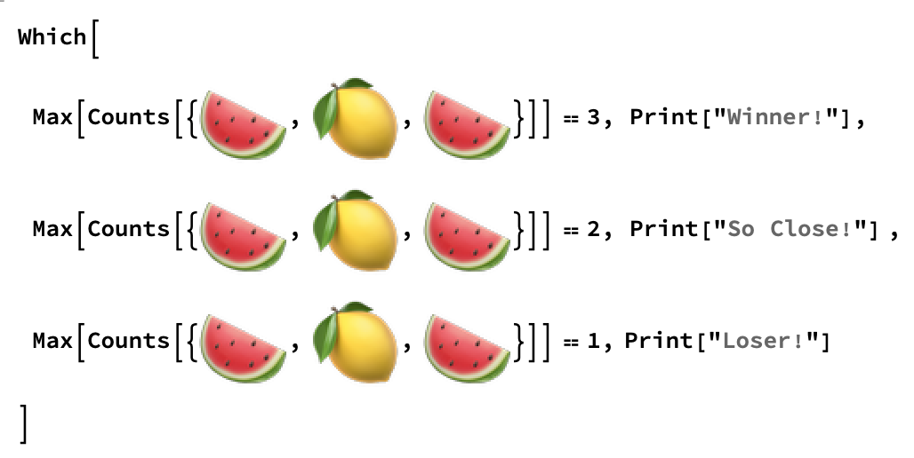

## Building a Game

There are three possible outcomes for the game: 3 fruit the same, 2 fruit the same, and all fruits different. 
3 the same is a win, 2 the same is a lose, all different is a lose.
We can find out if there are any duplicates by finding the `Count` of each fruit. We can then use `Max` to find out the largest number of duplicates.



So now we have a set of rules. If `Max` is 3, then we win, if `Max` is 2, then nothing happens, and if `Max` is 1, then we lose.

We can use these `Max` counts to build a game. If all three are the same, print 'Winner!', if two are the same, print 'So Close!', and if all three are different, print 'Loser!'

The best way to check if one of multiple conditions is true, and return a specific output if the contition is true, is a `Which` statement.

A `Which` statement takes an input (the list of randomly chosen fruits), and checks each condition in order. If the first answer is `True`, it returns the output for that rule. If the second one is `True`, it returns the output for that condition, and so on, until there are no more conditions to check.



--- task ---

Combine the random fruit picker and the game rules into a single function using a `Which` statement.


```
roll = RandomChoice[fruits, 3]
Which[
 Max[Counts[roll]] == 3, Print["Winner!"],
 Max[Counts[roll]] == 2, Print["So Close!"] ,
 Max[Counts[roll]] == 1, Print["Loser!"]]
 
```
--- /task ---