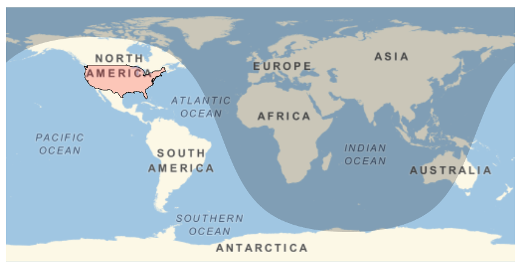
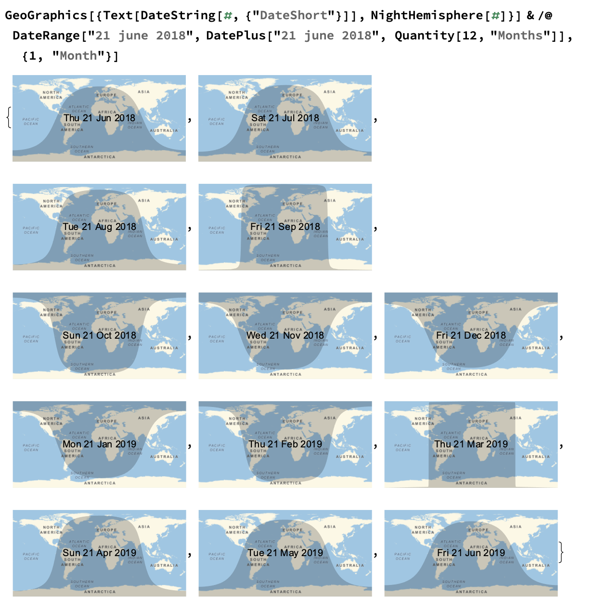

## Combining Features

So far, you've developed two features for your map: the night hemisphere, and highlighting a country. Now let's combine the two features into one map.


--- task --- 

Combine the two features you've made into one map function.

```
GeoGraphics[
 {
  NightHemisphere[],
  EdgeForm[Black],
  FaceForm[Red],
  Polygon[United States]
  },
 GeoRange -> "World"]
 
 ```
 --- /task --- 
 
Can you see how we put NightHemisphere and the Polygon into a list using `{}`? Putting different features into lists makes Wolfram treat them as one entity, which means that the GeoGraphics function can implement lots of things at the same time.


--- collapse ---
---
title: Day and Night Hemispheres
---

Interestingly, the NightHemisphere line will look different depending on the time of year, even though the shape of the night line doesn't change through the year. This is because the night line falls differently on this projection of the map, causing some distortion. On a globe, this line would be straight all the way around. You can see below how the line changes each month through the year.



  
--- /collapse ---
