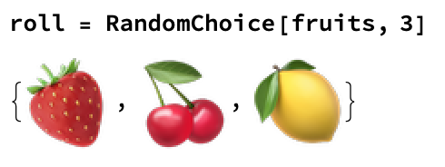

## Building a Game

We want players to be able to press a button to roll the fruit machine again, and for our program to output if they won or lost. To do this, we need to use a Which statement.
There are three possible outcomes for the game: 3 the same, 2 the same, all different. 
3 the same is a win, 2 the same is a lose, all different is a lose.
We can find out if there are any duplicates by finding the Count of each fruit. We can then use Max to find out the largest number of duplicates.


So now we have a set of rules. If Max is 3, then we win. If Max is 1, then we lose.

We can use these questions to build a game. If all three are the same, print 'Winner!', if two are the same, print 'So Close!', and if all three are different, print 'Loser!'

A Which statement takes an input (the list of randomly chosen fruits), and checks each rule in order. If the first answer is True, it returns the output for that question. If the second one is true, it returns the output for that question, and so on, until there are no more questions.


--- task ---
Let's combine the random fruit picker and the game rules into a single function. We can set the three random fruits as a variable, so that our code isn't so full of fruit!


```
roll = RandomChoice[fruits, 3]
Which[
 Max[Counts[roll]] == 3, Print["Winner!"],
 Max[Counts[roll]] == 2, Print["So Close!"] ,
 Max[Counts[roll]] == 1, Print["Loser!"]]
 
```
--- /task ---