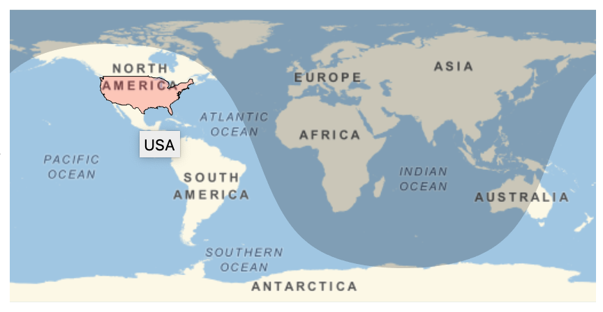
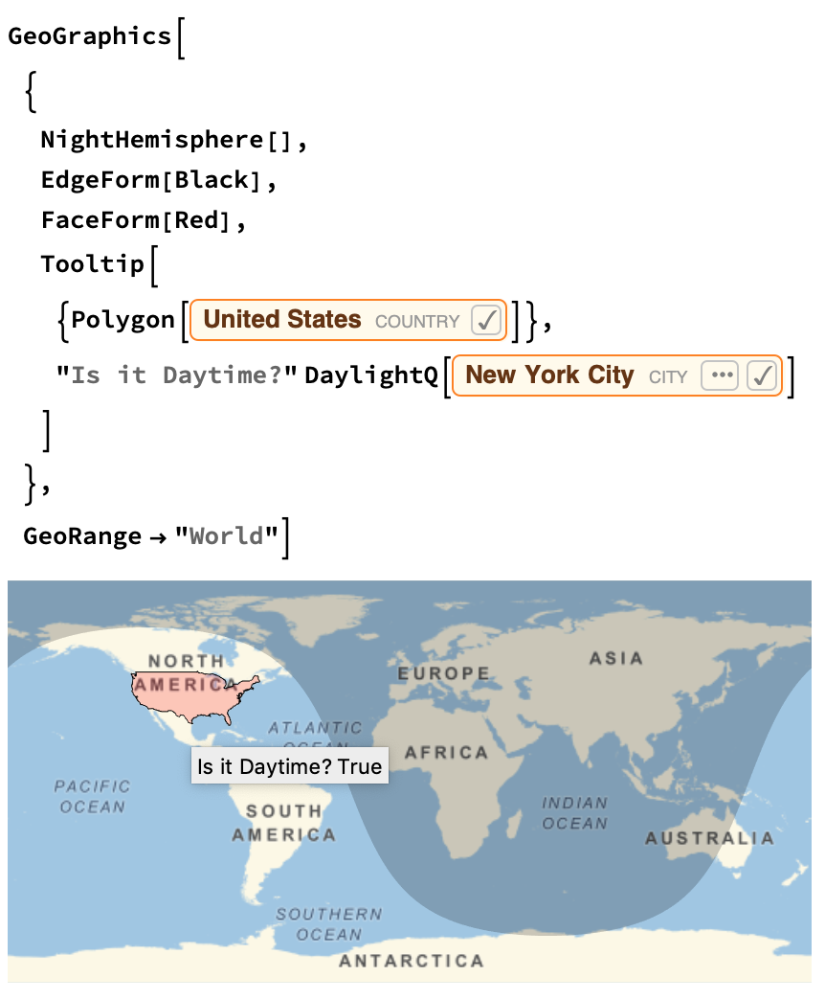
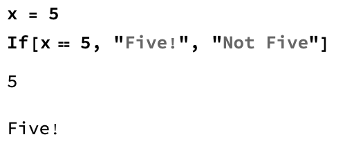
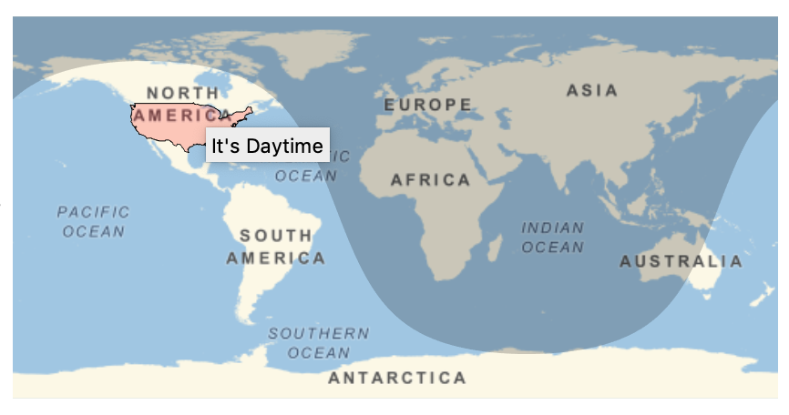

## Adding Information to Your Map

In this step, you're going to add a tool tip to your map, so that when people hover their cursor over the country you highlighted, they can get some information about that country.


--- task ---
First, make a really simple tool tip, which just displays "USA" when you hover over the United States on the map.

```
GeoGraphics[
 {
  NightHemisphere[],
  EdgeForm[Black],
  FaceForm[Red],
  Tooltip[
   {Polygon[United States]},
   "USA"
   ]
  },
 GeoRange -> "World"]
 ```



Hover your cursor over the highlighted country, and you'll see the text.

--- /task ---

Now that we've made a simple tooltip, we can start to make it more useful. How about a tool tip which tells us if the highlighted country is in daytime or nighttime?

For this, we can use the function `DaylightQ`. `DaylightQ` asks the system if it's daylight or not, and outputs either `True` or `False`. Look up `DaylightQ` in the Wolfram Documentation to find out more about how it works.

--- task ---
Change the tool tip from saying 'USA' to saying `True` if a city in the highlighted country is in daytime right now, and `False` if it is in nighttime.

You can replace code from the previous task with this new code.

```
GeoGraphics[
 {
  NightHemisphere[],
  EdgeForm[Black],
  FaceForm[Red],
  Tooltip[
   {Polygon[United States]},
   "Is it Daytime?" DaylightQ[New York City]
   ]
  },
 GeoRange -> "World"]
 ```
 
 
 
--- /task ---

--- collapse ---
---
title: How to Build an If Statement
---

The first thing in the If statment is the test. The test will render True or False. The second item in the If statement is what the code will return if the test is True, and the third is what the statement will return if the test is False

 
--- /collapse ---

We made it a little easier for people to get information from our map by adding the ability to hover over the country and find out if it is currently day or night. But at the moment, the tooltip only says 'True' or 'False'. It would be better to have the tool tip say 'It's Daytime' or 'It's Nighttime' instead.

In order to do this, we need an If statement.

--- task ---
Build an If statement which shows 'It's Daytime' on the tooltip if `DaylightQ` is True, and 'It's Nighttime' if `DaylightQ` is False.

You can replace code from the previous task with this new code.

 ```
 GeoGraphics[
 {
  NightHemisphere[],
  EdgeForm[Black],
  FaceForm[Red],
  Tooltip[
   {Polygon[United States]},
   If[
    DaylightQ[New York City],
    "It's Daytime",
     "It's Nighttime!"
    ]
   ]
  },
 GeoRange -> "World"]
 ```
  

--- /task ---

Now that we have an If Statement, we can add in some more information. It would be interesting to know, if it's daytime, when sunset will be, and if it's night time, when sunrise will be. We can find this information using the `Sunset[]` and `Sunrise[]` functions, and then taking the `TimeObject[]` of each of those functions. You need to use a city in the `Sunset[]` and `Sunrise[]` functions.

--- task ---

Extend your If statement to include What time the sunset will be if it's Daytime, and what time the sunrise will be if it's nighttime.

You can replace code from the previous task with this new code.

```
GeoGraphics[
 {
  NightHemisphere[],
  EdgeForm[Black],
  FaceForm[Red],
  Tooltip[
   Polygon[United States],
   If[DaylightQ[New York City],
    "It's Daytime! Sunset is at: "  TimeObject[
      Sunset[New York City]],
     "It's Nighttime! Sunrise is at: "  TimeObject[
      Sunrise[New York City]]
    ]
   ]
  },
 GeoRange -> "World"]
 ```
--- /task ---