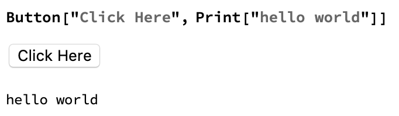

## Making the Game Playable

This is cool, but it's not very interactive yet. We still have to evaluate two cells in order to get our result. It would be better if we had a button which prints the fruit selection and the result every time we press it.
Buttons are very easy to make. Let's make a really simple one before we add it to our game.



Can you see how the function button works? Try changing what text displays on the button, or changing the output.
We want a button which selects three random pieces of fruit, and runs our Which function to display a result.

--- task ---
Try to put your Which statement and your roll variable into a button.


--- /task ---

--- task ---
If you implement this code, you might notice that every time you press the button, the new output appears underneath the old output. It would be better to replace the old output with the new output each time you press the button.

We can do this using Dynamic. Dynamic displays the dynamically updated value, so each time we reevaluate the code by pressing the button, Dynamic will update to the new value.

```
roll = RandomChoice[fruits, 3];
result = Text["Click Roll Again to Start"];
Button["Roll Again",
 roll = RandomChoice[fruits, 3];
 result =
  Which[
   Max[Counts[roll]] == 3, Text[ "Winner!"],
   Max[Counts[roll]] == 2, Text["So Close!"] ,
   Max[Counts[roll]] == 1, Text["Loser!"]]]
Dynamic[Grid[{roll}, Frame -> All, FrameStyle -> Thick]]
Dynamic[result]
```
--- /task ---