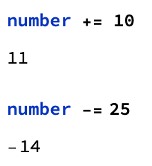

## Keeping Score

Great, now we can press a button and automatically get a new roll and the result. But what if we want to keep score? We'd need a variable to keep track, and we'd need to have each result in the Which statement add or subtract from the score. You can choose to have your game assign any score to each result.
Adding or subtracting from a number is pretty simple. We set the variable:
```
number = 1
```
And then we can add using +=, and take away using -=



So let's set up our score variable.

```
score = 100
```
Within the Which function, we can make multiple actions happen if our question is true by using a ;. This is called a Compound Expression. So for each possibility, we can add to or subtract from the score.


--- hints ---

--- hint ---

Start off by creating a score variable, and decide how many points each action (winning, getting 2, and losing) will gain/lose.


--- /hint ---

--- hint ---

Add the score changes to your Which statement using a ;

--- /hint ---

--- hint ---

```
result =
  Which[
   Max[Counts[roll]] == 3, score += 10; Text[ "Winner!"],
   Max[Counts[roll]] == 2, score += 2; Text[ "So Close!"],
   Max[Counts[roll]] == 1, score -= 10; Text[ "Loser!"]];

```
You will also need to show the Dynamic score at the end of the code.

--- /hint ---
--- hint ---

```
roll = RandomChoice[fruits, 3];
result = Text["Click Roll Again to Start"];
score = 100;
Button["Roll Again",
 roll = RandomChoice[fruits, 3];
 result =
  Which[
   Max[Counts[roll]] == 3, score += 10; Text[ "Winner!"],
   Max[Counts[roll]] == 2, score += 2; Text[ "So Close!"],
   Max[Counts[roll]] == 1, score -= 10; Text[ "Loser!"]];
 ]
Dynamic[Grid[{roll}, Frame -> All, FrameStyle -> Thick]]
Dynamic[result]
Dynamic[score]
```


--- /hint ---

--- /hints ---

