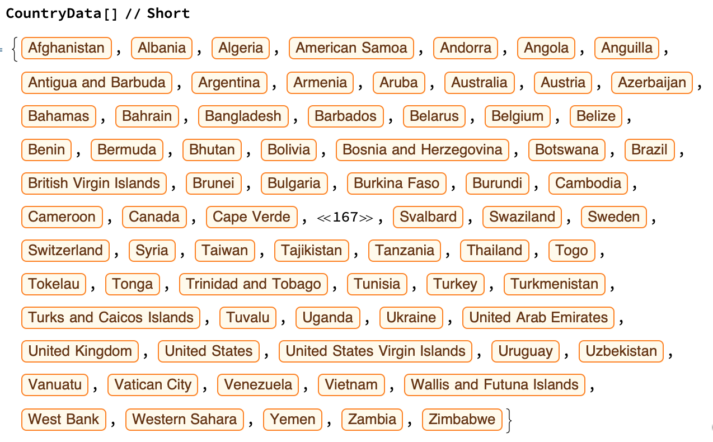

## Making your Map Interactive

So far, you've created a world map with the day and night hemispheres, where you can see a specific country, hover over that country to find out if it's day time or night time, and when the sun will rise or set. But what if you don't want to see information for the United States? It would take too much effort to change the code every time you wanted to see a different country. You could set up a little tool which allows your user to chose a country from a drop down menu.

In order to make a drop down menu of countries, we're going to need a list of every country in the world. Luckily, Wolfram has one built in!

```
CountryData[]
```


We can use `Manipulate` to make an interactive drop down list. `Manipulate` lets us use x as a placeholder, and then to replace x with a value that the user chooses. In order to create a `Manipulate`, we need to have a function with a placeholder variable, and a list of possibilities for what x could be.

--- task ---

Look at your original code for a simple map highlighting the USA:

```
GeoGraphics[
 {
  NightHemisphere[],
  EdgeForm[Black],
  FaceForm[Red],
  Polygon[United States]
  },
 GeoRange -> "World"]
 
 ```
 
 Incorporate this code into a `Manipulate`, with the options for the polygon shape coming from `CountryData`.
 
 ```
Manipulate[
GeoGraphics[
 {
  NightHemisphere[],
  EdgeForm[Black],
  FaceForm[Red],
  Polygon[x]
  },
 GeoRange -> "World"],
 {x, CountryData[]}
 ]
 
 ```
--- /task ---

Now we can select any country, and the map will change to highlight our selection!


