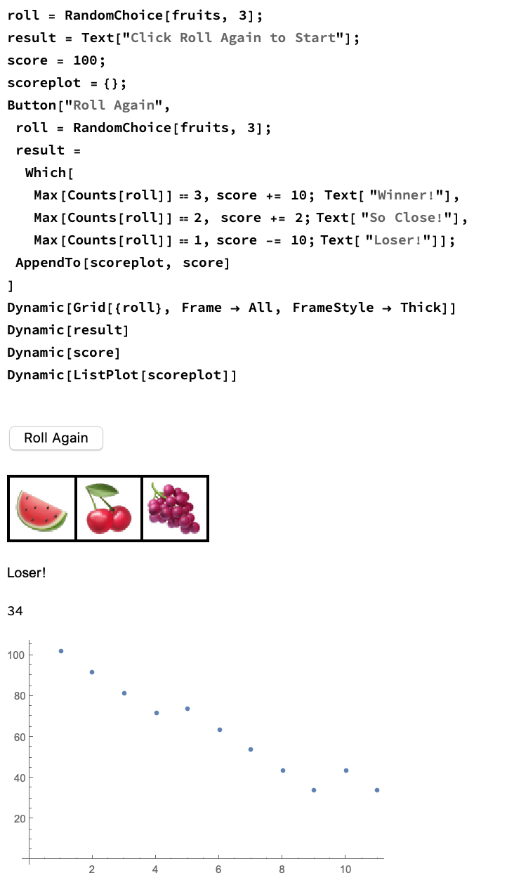

## Visualizing Scores

You might want to see how quickly your score goes up or down, depending on how you adjust the prizes in the game. Think about how you might go about collecting the scores of each game and visualizing them.

You could try making a graph of the scores. Every time you press the button to roll again, you could add the score to a list, and then plot the list.

To do this, you'd need another variable, an empty list where we can store the score every time the game is played.

```
scoreplot = {}
```
Every time we run 'Roll Again', we want to put the score into the scoreplot list. We can do that using AppendTo.

```
AppendTo[scoreplot, score]
```
We can simply add this line to the end of the code for the 'Roll Again' button, and add another Dynamic to show the ListPlot of the list of scores.



--- task ---
We will also need a way to reset the score. We can use another button to set the score back to 100, and to empty the scoreplot list

```
Button["Start Again", score = 100; scoreplot = {}]

 ```
 --- task ---

