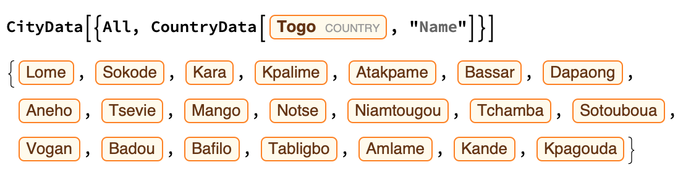

## Building the Interactive Map

Let's add our tool tip back in to our now interactive map. Remember that for DaylightQ, Sunrise and Sunset, you need to use a city instead of a country? Let's choose the largest city for the selected country in these functions.

You can find all the cities in a country.

```
CityData[{All, CountryData[Entity["Country", "Togo"], "Name"]}]

```


And, because the cities are listed in size order, you can find the largest city in a country by simply taking the `First` item in the `CityData` list.

```
First[CityData[{All, CountryData[Entity["Country", "Togo"], "Name"]}]]

```

--- task ---


Start by taking your code for your non-interactive map, and your code for your simple interactive map, and try to combine the two.

#### Code for non-interactive map:
```
GeoGraphics[{NightHemisphere[], EdgeForm[Black], FaceForm[Red], 
  Tooltip[{Polygon[United States]}, 
   If[DaylightQ[
     First[CityData[{All, CountryData[United States, "Name"]}], 1]], 
    "It's Daytime! Sunset is at: " TimeObject[
      Sunset[First[
        CityData[{All, CountryData[United States, "Name"]}], 1]]], 
    "It's Nighttime! Sunrise is at: " TimeObject[
      Sunrise[First[
        CityData[{All, CountryData[United States, "Name"]}], 1]]]]]}, 
 GeoRange -> "World"]
 ```
 Remember that you will need to convert United States into Free-Form Linguistic Input in order for this map to work.
 
#### Code for simple interactive map:
 
 ```
 Manipulate[
 GeoGraphics[
  {NightHemisphere[],
   {EdgeForm[Black],
    FaceForm[Red],
    Polygon[x]}
   },
  GeoRange -> "World"],
 {x, CountryData[]}
 ]
 ```
 
 Add the tool tip into the Manipulate code.

 ```
 Manipulate[
 GeoGraphics[
  {
   NightHemisphere[],
   EdgeForm[Black],
   FaceForm[Red],
   Tooltip[
    {Polygon[x]},
    If[DaylightQ[First[CityData[{All, CountryData[x, "Name"]}], 1]],
     "It's Daytime! Sunset is at: "  TimeObject[
       Sunset[First[CityData[{All, CountryData[x, "Name"]}], 1]]],
      "It's Nighttime! Sunrise is at: "  TimeObject[
       Sunrise[First[CityData[{All, CountryData[x, "Name"]}], 1]]]]
    ]
   },
  GeoRange -> "World"],
 {x, CountryData[]}
 ]
 ```
Your code might take a few seconds to run, it's doing a lot!

--- /task ---

